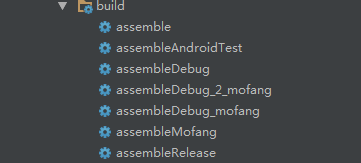
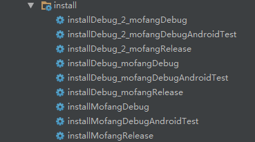

### 需求
> 由于在项目中有多个开发环境，甚至多层测试后才能发到线上（或者给到其他开发用，不同的环境），每次到不同的地方进行修改实在太麻烦了，也太麻烦了，所有决定进行统一管理和配置


### 实现
> 首先需要知道有哪些会因为开发环境，进行变动；然后进行实现修改，通过打包配置进而切换环境。

例如：会有本地、线上测试、正式环境3种url
首先我把他们放到arrays.xml
```
	<string-array name="user_urls">
        <item>https://userlocal.xx.cn/</item>
        <item>http://mf-1-user.xx.cn/</item>
        <item>http://mf-cs-user.xx.cn</item>
    </string-array>

    <string-array name="order_urls">
        <item>https://financelocal.xx.cn/</item>
        <item>http://mf-1-finance.xx.cn/</item>
        <item>http://mf-cs-finance.xx.cn</item>
    </string-array>

    <string-array name="token_urls">
        <item>https://jwtlocal.xx.cn/</item>
        <item>http://mf-1-login.xx.cn/</item>
        <item>http://mf-cs-jwt.xx.cn</item>
    </string-array>
```

然后如果通过何种方式可以方便的在打包的时候直接区分呢？

我是通过在`AndroidManifest.xml `中设置
```
        <meta-data
            android:name="appType"
            android:value="${appType}"/>
```
以及在`build.gradle`中
```
  productFlavors {
        debug_mofang{
            versionName "本地测试1.0.5.1"
            manifestPlaceholders = [
                    appType : 0,
                    APP_LOGO: "@mipmap/logo_debug",
                    MTA_CHANNEL  : "developer",
                    JPUSH_CHANNEL : "developer-default", 
            ]
        }

        debug_2_mofang{
            versionName "线上测试1.0.5.1"
            manifestPlaceholders = [
                    appType : 2,
                    APP_LOGO: "@mipmap/logo_debug",
                    MTA_CHANNEL  : "developer",
                    JPUSH_CHANNEL : "developer-default", 
            ]
        }

        mofang {
            versionName "1.0.5"
            manifestPlaceholders = [
                    appType : 1,
                    APP_LOGO: "@mipmap/logo",
                    MTA_CHANNEL  : "release",
                    JPUSH_CHANNEL : "developer-default", 
            ]
        }
    }
```
在使用的地方，通过以下方法获取`appType`
```
	public static int getAppTye(Context context){
		ApplicationInfo appInfo = null;
		try {
			appInfo = context
							.getPackageManager().getApplicationInfo(context.getPackageName(),
							PackageManager.GET_META_DATA);
		} catch (PackageManager.NameNotFoundException e) {
			e.printStackTrace();
		}
		if (null == appInfo){
			return 1;
		}
		int appType = appInfo.metaData.getInt("appType");
		LogUtil.i("appType = " + appType);
		return appType;
	}
```

使用由于我使用了xutils3：

```
	public static String getOrderUrl(int type){
		String[] urls = x.app()
						.getApplicationContext()
						.getResources()
						.getStringArray(R.array.order_urls);
		LogUtil.i("OrderUrl = " + urls[type]);
		return urls[type];
	}
	public static String getTokenUrl(int type){
		String[] urls = x.app()
						.getApplicationContext()
						.getResources()
						.getStringArray(R.array.token_urls);
		LogUtil.i("TokenUrl = " + urls[type]);
		return urls[type];
	}

	public static String getUpdateUrl(int type){
		String[] urls = x.app()
						.getApplicationContext()
						.getResources()
						.getStringArray(R.array.update_urls);
		LogUtil.i("UpdateUrl = " + urls[type]);
		return urls[type];
	}

```
获取到不同的url

```
    int apiType = WebUtils.getAppTye(x.app().getApplicationContext());
    String HTTP_USER   = UrlUtils.getUserUrl(apiType) ;
    String HTTP_ORDER  = UrlUtils.getOrderUrl(apiType) ;
    String HTTP_TOKEN  = UrlUtils.getTokenUrl(apiType) ;
```

然后`Sync now`就可看到

  

安装

  


打包时，通过配置获取到appType，自动切换不同的使用环境。