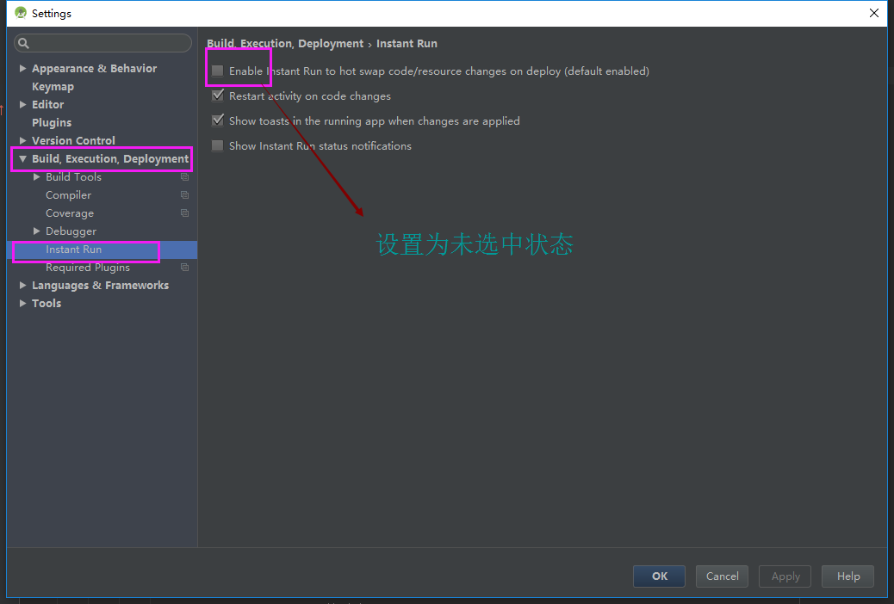

1.Binary XML file line #0: Error inflating class me.imid.swipebacklayout.lib.SwipeBackLayout

```
解决了，主activitycontainerlayout问题，改成linearlayout就好了
```

1、  java.lang.VerifyError: Verifier rejected class com.shetj.diyalbume.MainActivity due to bad method java.lang.Object com.shetj.diyalbume.MainActivity.access$super(com.shetj.diyalbume.MainActivity, java.lang.String, java.lang.Object[]) (declaration of 'com.shetj.diyalbume.MainActivity' appears in /data/app/com.shetj.diyalbume-2/split_lib_slice_7_apk.apk)


