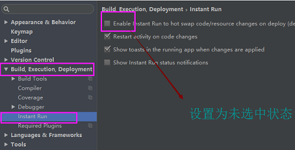

1. Binary XML file line #0: Error inflating class me.imid.swipebacklayout.lib.SwipeBackLayout

```
解决了，主activitycontainerlayout问题，改成linearlayout就好了
```

2. java.lang.VerifyError: Verifier rejected class com.shetj.diyalbume.MainActivity due to bad method java.lang.Object com.shetj.diyalbume.MainActivity.access$super(com.shetj.diyalbume.MainActivity, java.lang.String, java.lang.Object[]) (declaration of 'com.shetj.diyalbume.MainActivity' appears in /data/app/com.shetj.diyalbume-2/split_lib_slice_7_apk.apk)




2. Android 8.0 系统下，PushService 会引起崩溃？

>这个问题是 8.0 系统的权限收紧引起的。大家可以在 AVOSCloud.initialize 之前调用代码 PushService.setAutoWakeUp(false)，禁止掉 PushService 的自启动。这样能暂时规避这个问题。

>与此同时，我们预计在 11 月底发布对 Android 8.0 的全面适配。

3. ListView、RecyclerView、ScorllView、Viewpager 等等，取消顶部半圆形的拉力纹

>android:overScrollMode="never"

4. EditText 显示两行的高度
```
    android:inputType="textMultiLine" //可以显示多行
    android:gravity="left|top" //输入时光标左上角
    android:minLines="6" //最小显示6行
 ```
 5. 跳转activity，清空之前activity栈

 问题描述：
 开发中，遇到退出登录时，需要将界面跳转到登录界面，并将栈中所有Activity清空。

 解决办法

 Intent intent = new Intent(A.this,B.class).setFlags(Intent.FLAG_ACTIVITY_CLEAR_TASK | Intent.FLAG_ACTIVITY_NEW_TASK);
 startActivity(intent);
 startActivity 的时候传递 FLAG_ACTIVITY_CLEAR_TASK 这个标志,那么这个标志将会清除之前所有已经打开的 activity .然后将会变成另外一个空栈的 root ,然后其他的 Activitys 就都被关闭了.这个方法必须跟着 {@link #FLAG_ACTIVITY_NEW_TASK} 一起使用.

记一次使用xutils3的数据库模块的教训org.xutils.ex.DbException: <init> []

在使用xutil3的数据库模块的时候出现报错org.xutils.ex.DbException: <init> []
问题原因：创建数据库的bean在生成有参数的构造方法时覆盖了没参数的构造方法

解决：生成不带参数的构造方法


Error:Execution failed for task ':app:preDebugBuild'.
> Android dependency 'com.android.support:appcompat-v7' has different version for the compile (26.1.0) and runtime (27.0.2) classpath. You should manually set the same version via DependencyResolution