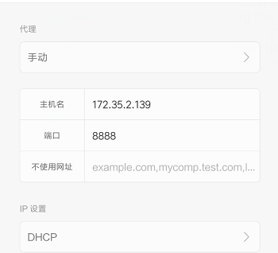
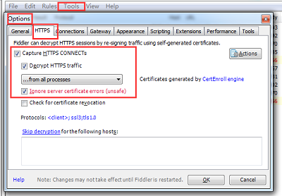
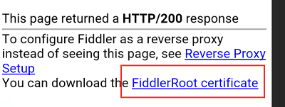
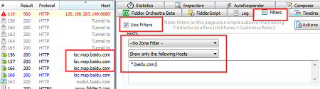
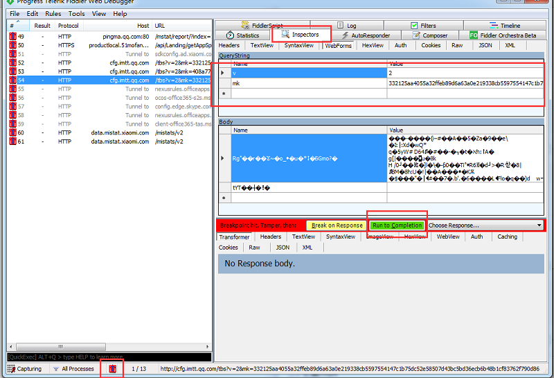

#### Fiddler使用记录

##### 一、拦截手机请求

1、打开电脑Fiddler，并获取到电脑IP

2、修改WIFI,进行代理

##### 二、拦截https
1、修改Fiddler

2、手机浏览器输入 IP:8888 安装证书

3、重启

##### 三、过滤请求

#####  四、修改请求
1、首先F11,把所有请求拦截下来，单不进行发送请求
2、手机点击发起
3、修改请求参数，并继续请求

