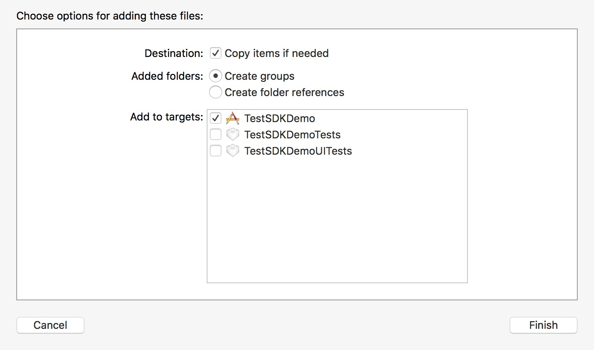
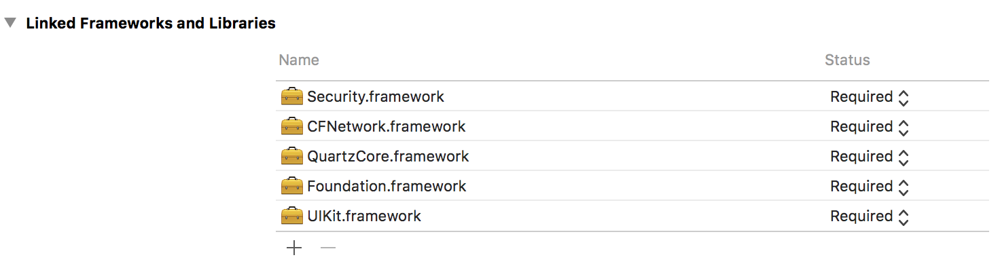
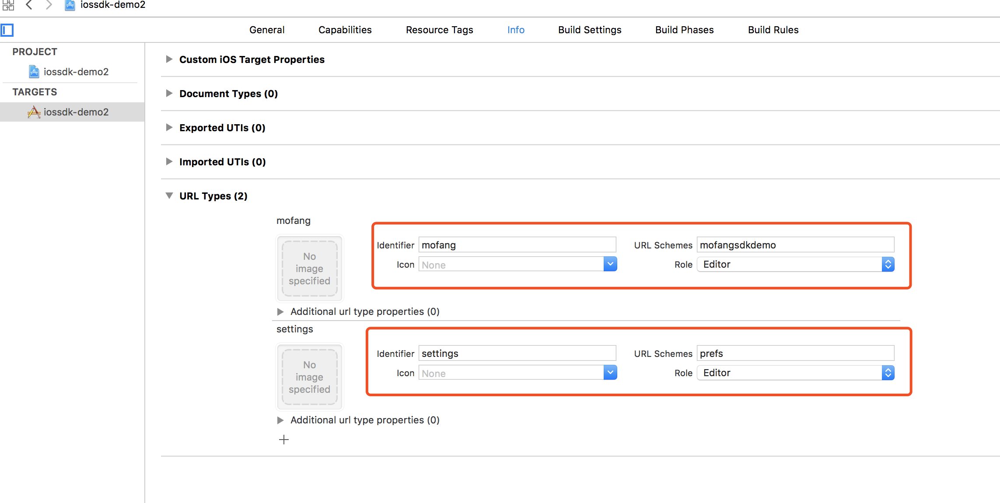
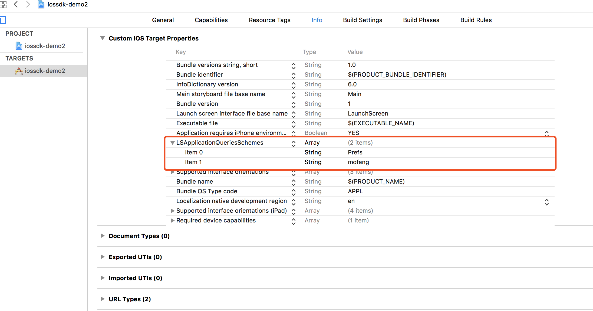

# 第一阶段  创建产品信息 #

通过后台管理创建产品，设置产品信息获取到`GameId` 和 `AppKey` ,用户请保存好，后续操作验证需要用到。


# 第二阶段  产品接入 #

## 一、前端接入 ##

### Android SDK 接入  

##### 1、SDK版本   

 `versionName "1.0.2.0"`
		
 魔方裂变SDK：

   `mofangsdk-release_1.0.2.0.aar`，内部自带网络请求框架`okhttputils:2.6.2`、`okhttp3.8.1`

#### 2、使用说明 ####

##### 1.导入SDK
    
    默认使用 .aar 文件,放入引用Module的libs目录下，gradle配置文件中把libs 目录放入依赖：
    
    repositories{
       flatDir{
      	dirs'libs'
      }
    }
     /*
    //如果是放在其他model导入aar,进行引用
    repositories {
    flatDir {
       // dirs '../model的名字/libs', 'libs'
       dirs '../pay/libs', 'libs'
    }
    }


  并在gradle文件中使用依赖的方式引用aar：

`compile(name:'xxx',ext:'aar')`
  

##### 2.SDK配置  
  设置AndroidManifest.xml文件，声明使用权限(必须)：

`<uses-permission android:name="android.permission.INTERNET"/>`

  加入使用的support版本

`compile 'com.android.support:appcompat-v7:+'`

  SDK中有使用到recyclerview,如果使用的 `v7` 包中没有找到`recyclerview`，请额外加入：
   
`compile 'com.android.support:recyclerview-v7:+'`
     
##### 3.接入说明  

1. 在游戏界面，请做如下初始化工作(必须，否则 部分操作异常)：

	MFangHelper.getInstance(this).init(gameId);

1. 悬浮球控制(必须)：  
	
    注意必须在Activity的`onDestroy()` 中实现以下方法:
       
    	@Override
    	protected void onDestroy() {
    		super.onDestroy();
    		MFangHelper.getInstance(this).onDestroy();
    	}
    
     设置悬浮球的相关方法：是否可以移动、`x`坐标（超过一半时自动靠另一边）、`y`坐标：

	    MFangHelper.getInstance(this).setFloatViewInfo(isCanMove,x,y);//自动靠边
	    MFangHelper.getInstance(this).setFloatViewPosition(x1, y1);//自动靠边
	    MFangHelper.getInstance(this).setFloatViewIsMove(isCanMove);

1. 设置登录登出后一些操作：  

    	 MFangHelper.getInstance(this).setLoginListener(new LoginListener() {

			@Override
			public void onTourist() {
				//游客登录状态
			}

            @Override
            public void onLogin(String phone) {
				//phone 为登录的电话号码
				//登录成功
            }

            @Override
            public void onLogout() {
				//注销成功
            }
        });


1. 设置服务电话：

    	MFangHelper.getInstance(this).setServicePhone("10000");

1. 展示订单信息,并进行支付：


  	`CP`通过自己的后台创建订单后，在自己的服务器签名，规则如下：

 		MD5(account=[account]&game_id=[game_id]&order_number=[order_number]&timestamp=[timestamp]&key=[app_key])（签名不需要括号）

  	然后调用SDK以下方法进行展示订单并支付：

   	 	MFangHelper.getInstance(MainActivity.this).showOrderDetail(MainActivity.this,money,remarks,orderNumber,timestamp,sign);
  	


1. 设置支付回调接受，`onActivityResult` 中接收支付返回结果（**支付，必须**）：   

		MFangHelper.getInstance(this).setPayCallBack(new MFangPayCallBack() {
			@Override
			public void paySuccess(String orderNumber) {
			}

			@Override
			public void payFail(int resultCode, String orderNumber) {
			}
		});
   
		@Override
		protected void onActivityResult(int requestCode, int resultCode, Intent data) {
			super.onActivityResult(requestCode, resultCode, data);
			MFangHelper.getInstance(this).onActivityResult(this, requestCode, resultCode, data);
		}


### IOS SDK 接入  ###

0. #### 下载 SDK ####

1. #### 导入 SDK 文件 ####

	将 `Mofang.framework` 和 `Mofang.bundle` 导入到 `Xcode` 工程项目中。
	
	
	
2. #### `TARGETS` - `General` - `Linked Frameworks and Libraries`，添加所需的 frameworks ####

    ```
>     1. Security.framework
> 	2. CFNetwork.framework
> 	3. QuartzCore.framework
> 	4. Foundation.framework
> 	5. UIKit.framework
    ```

   
	
3. #### XCode 设置 ####
	
	4.1. `TARGETS` - `Info` - `URL Types`，新建两个 schema：`prefs`（跳转系统设置）、app自用（支付完成之后跳转回应用）
	
	

	
	
	4.2 `TARGETS` - `Info` - `Custom iOS Target Properties`，`LSApplicationQueriesSchemes` 添加 `Prefs`、`mofang`，允许跳转`系统设置`和`魔方裂变`。
	

	
5. #### 引入头文件 ####
   
    	// 需要的文件内引入头文件
    		#import <Mofang/Mofang.h>

	
6. #### 初始化设置 ####
	
	```
	可以加在：

    	- (BOOL)application:(UIApplication *)application didFinishLaunchingWithOptions:(NSDictionary *)launchOptions
    	
	
    	// 配置悬浮球信息（本方法必须在前面）
    	[[Mofang shared] setupFloatMenuConfig:YES   // 是否可以拖动
    	   widthAnchorOrientation:@"right"  // 悬浮球位置，left/right
    	  widthAnchorDistance:0.f]; // 距离顶部高度，0.f 默认在中间
    
    	// 配置信息，展示登录界面
    	[[Mofang shared] startWithAppKey:@"appkey" // APPKEY
    	  withSchema:@"mofangsdkdemo"  // app schema
    	withServicePhone:@"10000"  // 客服电话
    	   withDebug:YES]; // 是否开启调试信息
	```
	
	```

		// 监听支付完成与否消息
	
    	- (BOOL)application:(UIApplication *)application handleOpenURL:(NSURL *)url {
    	[[Mofang shared] handleOpenURL:url];
    	return YES;
    	}
    	
    	- (BOOL)application:(UIApplication *)application openURL:(NSURL *)url sourceApplication:(NSString *)sourceApplication annotation:(id)annotation {
    	[[Mofang shared] handleOpenURL:url];
    	return YES;
    	}
	```


7. #### 新建支付订单 ####

	```
	  [[Mofang shared] createOrder:@"20171010090912345"          // 流水号
                       withRemarks:@"无敌药水"                    // 商品备注
                         withPrice:120.0                         // 商品金额
               withCallbackAddress:@"http://www.51mofang.cn"];   // 支付完成回调地址
	```	


8. #### 其他方法 ####

	```

    	// 登录回调
    	[[Mofang shared] onSignIn: ^(NSString *mobilePhone){
   			 NSLog(@"登录手机号 %@", mobilePhone);
      	 }];
      
     
    	// 注销回调
    	[[Mofang shared] onSignOut: ^{
    	NSLog(@"注销成功");
      	}];
	```	


### Javascript SDK  接入 ###

#### 1、在 head 引入资源 ####

    <script src="mofang.min.js"></script>

#### 2、应用配置 ####

     // 初始化
     mofang({
       appKey: 'appkey',  // APPKey
       servicePhone: '10000', // 客服电话
       debug: true// 调试选项
     })


#### 3、新建订单 ####

    // 生成订单
    mofang.createOrder({
      productName: '无敌药水', // 商品备注
      tradingNumber: '20171010090912345', // 流水号
      price: 120.0,   // 商品价格
      callbackAddress: 'http://www.51mofang.cn',  // 支付成功回调地址
      returnAddress: 'http://www.51mofang.cn' // 支付完成跳转地址
    }, function (err, res) {
      console.log(err, res)
    })


#### 4、其他方法 ####

    // 登录成功
    mofang.on('signIn', function (data) {
      console.log('signIn', data)
    })
    
    // 注销成功
    mofang.on('signOut', function (data) {
      console.log('signOut', data)
    })

## 二、后台接入 ##

### 1、登录验证 ###

使用前端`SDK`登录成功后会返回一个`cp_token`,通过 `cp_token` 和以下接口，验证登录是否来自魔方服务器。

接口地址：

    http://mf-2-product.51mofang.cn/api/SDKLogin/CP_Verify

请求方式：

	POST 
参数：

	cp_token （通过SDK获取，一次性token,有效期1分钟）

返回示例：

     {
      "code": 0,
      "msg": "成功",
      "data": {
    	  "timestamp": 1510203950179,
      "sign": "f977fa32531cf53a760b0aa22def8f7f"
      }
    }

`code`标志 ：

     code	0	int	验证成功
     code	1	int	验证失败

`sign`验证方式：

> 	CP通过接口后，获取到数据后，这里最好在进行一次数据验证，如果sign = MD5(GameId + uno + AppKey + timestamp) 小写32位；
> 	如果相等，说明来自魔方服务器，否则不是。

### 2、创建预支付订单 ###

`cp`后台服务器通过该接口创建预支付订单，

接口地址：
    
	http://mf-1-finance.51mofang.cn/api/Finance/addRechargeOrder_cp

请求方式：

```
Post
```

请求参数：

|参数	|参数类型	|是否可空	|参数说明|
| --------  | -----:   | :----: |:-------------:|
|account	|string	|N	|充值用户编号（魔方）
|game_id	|string|	N	|游戏编号
|cp_order	|string	|N	|商户单号
|money	|string	|N	|充值金额
|remarks	|string	|N	|备注
|callback_address	|string	|N	|支付通知地址
|return_address	|string	|N	|支付回调地址
|timestamp	|string	|N	|时间戳（13位）
|sign	|string	|N	|签名

示例

    {
      "account": "52610",
      "game_id": "cn.a51mofang.sdk.app",
      "cp_order": "ord_835763",
      "money": "100",
      "remarks": "钢铁战甲2",
      "callback_address": "www.51mofang.cn",
      "return_address": "http://mf.51mofang.cn",
      "timestamp": "1510226156915",
      "sign": "5123dd852999c08b1bf40cf9a2e7f5e9"
    }


请求参数：`sign`生成规则：

   按照字典排序组成字符串+`key`，得到`待签名`字符串，再将该待签名字符串进行`MD5`加密,其中`key`、`gameId`为第一阶段获取的`AppKey`,`GameId`。魔方服务器会通过`sign`检测请求我合法性和真实性, `MD5(待签名) = sign`。
   示例：

       待签名 = account=52610&callback_address=www.51mofang.cn&cp_order=ord_835763&gameId=cn.a51mofang.sdk.app&money=100&remarks=钢铁战甲2&return_address=http://mf.51mofang.cn&timestamp=1510226156915&key=449043c6-8b98-11e7-ba5d-00155d02fa01

	

返回格式：

|参数	|参数类型	|是否可空	|参数说明
| --------      | -----:   | :----: |:-------------:|
| code	|int	| N	| 返回编号
| msg	| string	| Y	| 错误信息
| data	| string	| N	| 返回结果

返回`data`中的参数

|参数	|参数类型	|是否可空	|参数说明
| --------      | -----:   | :----: |:-------------:|
|account	|string	|N	|充值用户编号
|game_id	|string	|N	|游戏编号
|order_number	|string	|N	|魔方订单号
|sign	|string   |	N	|签名

示例：

    {
      "code": 0,
      "msg": null,
      "data": {
			  "account":"52610"
    	      "game_id":"cn.a51mofang.sdk.app"
	          "order_number":"201711091237135483840"
	          "sign":"022d74668e44112dbd01534c89e31f58"
    }
    }

校验`返回值`的合法性，真实性：

```
MD5(account=[account]&game_id=[game_id]&order_number=[order_number]&key=[app_key]) 是否和 sign 相等（签名不需要括号）
```


### 3、支付回调 ###

 1.订单支付成功后，平台会发送**3**次`post`请求访问cp提交订单的参数 `callback_address` 所填写的地址，每次间隔5分钟，中途如收到`cp`成功返回的数据会停止通知。


 2.发送支付结果

     |参数名称	    |参数类型		|参数说明		|是否为空		|备注
	 | --------      | -----:   | :----: |:-------------:| -----:|
     |cp_order		|String		|cp订单号		|N		|cp传递的订单号
     |mf_order		|String		|魔方订单号		|N		|魔方平台订单号
     |pay_time		|String		|支付时间		|N		|订单完成支付时间
     |payType		|String		|支付方式		|N		|订单支付方式
     |return_code   | String	|订单状态	 	|N		|支付成功返回：SUCCESS；失败为FAIL
     |sign			|String		|签名 			|N		|用作验证签名
     |signType		|String		|加密方式		|N		|MD5加密
     |total_fee		|String		|交易金额		|N		|订单交易金额


例：

    <xml>
    <cp_order><![CDATA[ord_835762]]></cp_order>
    <mf_order><![CDATA[201711011423289607600]]></mf_order>
    <pay_time><![CDATA[20171101142352]]></pay_time>
    <payType><![CDATA[Alipay]]></payType>
    <return_code><![CDATA[SUCCESS]]></return_code>
    <sign><![CDATA[585269635C78C7588A174232621EBF52]]></sign>
    <signType><![CDATA[MD5]]></signType>
    <total_fee><![CDATA[10.00]]></total_fee>
    </xml>


 3.将通知返回参数列表中除去`sign`，按照字典排序组成字符串+`key`，得到`待签名字符`。其中`key`为第一阶段获取的`AppKey`。
  例子：
    
	待签名字段 = cp_order=ord_835762&mf_order=201711011423289607600&pay_time=20171101142352&payType=Alipay&retu	rn_code=SUCCESS&signType=MD5&total_fee=10.00&key=123456


4.检验真实性合法性，将`待签名字段`进行`MD5`签名，验证`sign`，

	MD5(待签名字段)	= sign

如果检验成功说明来自魔方服务。
	
通过以下格式，返回成功接收到支付回调，结束`**回调支付**`流程，例：

    <xml><return_code><![CDATA[SUCCESS]]></return_code><return_msg><![CDATA[OK]]></return_msg></xml>

# 第三阶段  上线测试#

